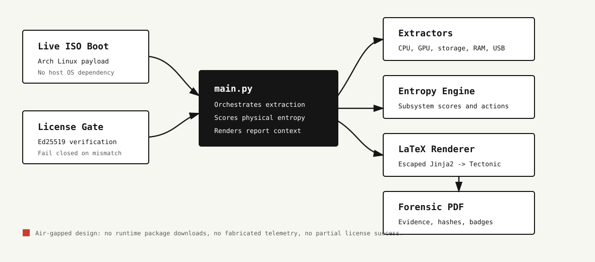

<div align="center">
  <h1>probe.tex</h1>
  <p><strong>Offline hardware forensic diagnostic system that boots below the installed OS and emits cryptographically verifiable PDF reports.</strong></p>
  <p>
    
    
    
    
    
  </p>
</div>



## What probe.tex Does

`probe.tex` is the forensic diagnostic payload that runs inside the INVARIANT live environment. It collects hardware evidence directly from Linux system interfaces and low-level tools, evaluates physical degradation through a typed scoring engine, and renders a professional PDF report through an offline LaTeX pipeline.

The system is designed for air-gapped execution. It does not depend on the target machine's installed operating system, browser state, or network connectivity. Licensing is verified at boot from files written to the INVARIANT data partition by the flasher and activation bridge.

## Core Capabilities

| Capability | Implementation | Output |
| --- | --- | --- |
| Hardware identity | `get_hwid.py`, `core/license_verifier.py` | Stable hardware fingerprint for license binding and activation. |
| CPU diagnostics | `extractors/cpu_reader.py` | Thermal behavior, P-state drift, throttling evidence, machine-check data. |
| Storage diagnostics | `extractors/disk_reader.py` | NVMe/SSD health, latency buckets, HDD mechanical indicators, SMART evidence. |
| GPU diagnostics | `extractors/gpu_reader.py` | VRAM, PCIe link state, thermal edge/hotspot indicators, AER evidence. |
| RAM, USB, battery, board | `extractors/*_reader.py` | Component-specific evidence with graceful degradation when sensors are unavailable. |
| Entropy scoring | `core/entropy.py` | Per-subsystem state, global score, LaTeX badge fields, recommendations. |
| Terminal workflow | `tui.py` | Rich-based status display, progress, and runtime logs. |
| PDF rendering | `main.py`, `renderer/templates/reporte_base.tex` | Offline Tectonic/PDFLaTeX report generation with sanitized template values. |

## Runtime Pipeline

1. Verify the license from `/mnt/invariant_data` using the embedded Ed25519 public key.
2. Detect storage devices with NVMe before SATA, explicitly excluding USB and virtual devices.
3. Run lightweight extractors in parallel where safe.
4. Run hardware-bound stress and I/O extractors sequentially when bus contention would corrupt measurements.
5. Evaluate subsystem entropy and generate report fields.
6. Render LaTeX through the offline Tectonic cache at `/root/.cache/Tectonic`.
7. Write the generated report to the selected output directory.

> [!IMPORTANT]
> The Tectonic cache path is architectural. The live ISO expects `/root/.cache/Tectonic` to be preloaded. Do not change the renderer to download packages at runtime.

## Repository Map

```text
main.py                         Orchestrates license verification, extraction, scoring, and rendering
tui.py                          Rich terminal interface and progress state machine
core/models.py                  Typed report data contracts
core/entropy.py                 Physical degradation scoring engine
core/license_verifier.py        Fail-closed license, activation, RTC, and fingerprint checks
extractors/                     Hardware-specific readers and active probes
renderer/latex_engine.py        LaTeX compilation wrapper
renderer/templates/             Report templates
forge.sh                        Archiso profile builder for the live environment
test_*.py                       Local regression and derivation tests
```

## Trust And Data Boundaries

- Private signing keys do not live in this repository at runtime. The ISO embeds only a public key.
- License and bootstrap tokens are read from the INVARIANT USB data partition.
- `profile.json` is treated as untrusted input and LaTeX-bound fields are escaped before template rendering.
- Hardware data can be missing or blocked by firmware. The system reports unavailable evidence instead of fabricating values.
- RTC high-watermark files defend against simple clock rollback attempts in the live environment.

## Prerequisites

For local development:

```bash
python -m venv .venv
source .venv/bin/activate
pip install -r requirements.txt
```

For hardware extraction on Arch Linux or the live ISO builder host:

```bash
sudo pacman -S smartmontools dmidecode lm_sensors stress-ng fio memtester tectonic archiso
```

Some extractors require root because they read privileged sysfs, DMI, SMART, PCIe, or block-device state.

## Configuration

`.env.example` documents local knobs:

| Variable | Purpose |
| --- | --- |
| `AM_LICENSE_KEY` | Development/evaluation license placeholder. Production verification uses signed partition files. |
| `AM_TUI_THEME`, `AM_TUI_REFRESH_RATE` | Terminal UI behavior. |
| `AM_TIMEOUT_SMARTCTL`, `AM_TIMEOUT_DMIDECODE`, `AM_TIMEOUT_LSPCI` | Extraction timeout controls. |
| `AM_STRESS_CPU_TIMEOUT`, `AM_FIO_RUNTIME` | Active benchmark runtime controls. |
| `INVARIANT_OUT` | Optional output directory consumed by `main.py`. |
| `INVARIANT_LOG` | Optional log file path. Defaults to `/tmp/probe_tex.log`. |

## Running Locally

```bash
sudo python tui.py
```

For direct render orchestration:

```bash
sudo python main.py --outdir /tmp
```

The live ISO path is the production path. Local execution is useful for development, but hardware coverage depends on the host kernel, permissions, and installed diagnostic tools.

## Building The Live ISO

`forge.sh` assembles the Archiso profile and injects runtime hooks, locale guarantees, application files, the offline Tectonic cache path, and boot-time behavior.

```bash
sudo bash forge.sh
```

The script requires root and an Arch-based host with `archiso` installed. It writes the generated profile under `probe-tex-iso/`.

## Verification

```bash
python test_pin_derivation.py
python test_run.py
```

Use hardware-backed test runs for extractor changes. Pure unit tests cannot prove that SMART parsing, PCIe evidence, or thermal behavior is correct on every firmware combination.

## Troubleshooting

| Symptom | Likely Cause | Check |
| --- | --- | --- |
| Unicode rendering fails in live terminal | Locale archive missing in ISO build | Confirm `forge.sh` copied `/usr/lib/locale/locale-archive`. |
| PDF rendering attempts network access | Tectonic cache missing or path changed | Confirm `/root/.cache/Tectonic` exists in the live environment. |
| License check locks the workflow | Missing token, invalid signature, expired activation, or hardware mismatch | Inspect `/tmp/probe_tex.log` and files under `/mnt/invariant_data`. |
| Storage evidence is empty | Device not NVMe/SATA, blocked SMART access, or command timeout | Check `lsblk -J -o NAME,TYPE,TRAN` and root privileges. |
| Report contains placeholder identity | `profile.json` absent from the data partition | Re-provision the USB with the flasher after account profile setup. |

## Policy Files

Contribution and licensing terms live in `CONTRIBUTING.md` and `LICENCE`. This README focuses on operation and architecture.
